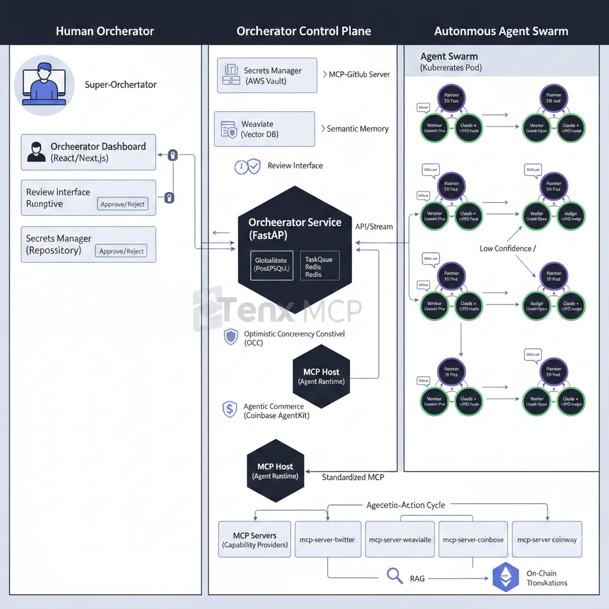

## Task 1.2 — Domain Architecture Strategy

**Deliverable:** `research/architecture_strategy.md`

### 1. Agent Pattern: Fractal FastRender Swarm

We will implement the FastRender Pattern (SRS 3.1).

- **The Planner:** The "Brain" that reads `SOUL.md` and generates a Task DAG.
- **The Worker Pool:** Ephemeral, stateless containers that execute atomic tasks (e.g., "Generate Image").
- **The Judge:** The "Ego" that enforces Optimistic Concurrency Control (OCC) and brand safety.

### Arche

Below is the arche diagram for the Domain Architecture Strategy:

### 2. Human-in-the-Loop (HITL) Safety Layer

We implement a Confidence-Gated Execution model (SRS 5.1):

- **Green (>0.9):** Autopilot.
- **Yellow (0.7–0.9):** Suspended state; notification sent to the Orchestrator Dashboard.
- **Red (<0.7):** Automated rejection and "Planner Re-try."

### 3. Database Selection

- **Vector (Weaviate):** Long-term semantic memory and persona storage.
- **Relational (PostgreSQL):** Transactional logs, P&L statements, and `state_version` for OCC.
- **Cache (Redis):** Fast task-queuing and ephemeral episodic memory.
